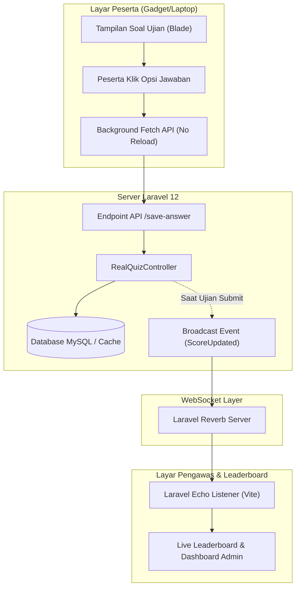
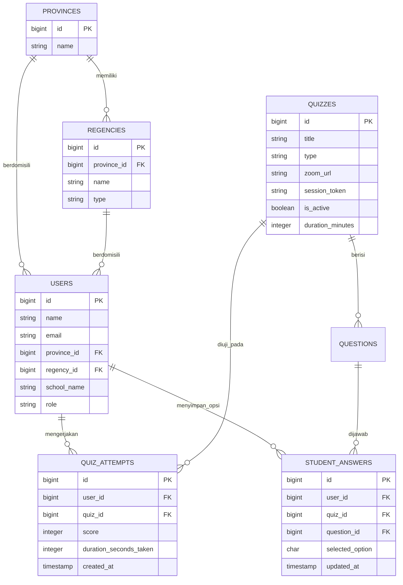

# Dokumen Analisis Kebutuhan Sistem & Arsitektur Realtime
## Platform Seleksi Online Empat Pilar MPR RI (Laravel + Vite)

> [!NOTE]
> **Status Dokumen:** Rancangan Analisis Teknis & Arsitektur Sistem  
> **Target Framework:** Laravel 12 + Vite (Blade, Vanilla JS, CSS murni)  
> **Konfirmasi Stack:** 100% Menggunakan **Laravel + Vite** bawaan tanpa memerlukan framework SPA terpisah (React/Vue/Next.js).

---

## Daftar Isi
1. [Latar Belakang & Konsep Arsitektur](#1-latar-belakang--konsep-arsitektur)
2. [Analisis 7 Poin Kebutuhan Revisi](#2-analisis-7-poin-kebutuhan-revisi)
   - [2.1 Leaderboard Berjenjang (Provinsi & Kab/Kota)](#21-leaderboard-berjenjang-provinsi--kabkota)
   - [2.2 Pengacakan Soal per Wilayah/Provinsi](#22-pengacakan-soal-per-wilayahprovinsi)
   - [2.3 Modul Video Panduan Pendaftaran & Seleksi](#23-modul-video-panduan-pendaftaran--seleksi)
   - [2.4 Customer Service & Helpdesk Peserta](#24-customer-service--helpdesk-peserta)
   - [2.5 Fasilitas Pengawasan Ujian (Zoom Proctoring)](#25-fasilitas-pengawasan-ujian-zoom-proctoring)
   - [2.6 Sistem Keamanan Anti-Screenshot Layar Gadget](#26-sistem-keamanan-anti-screenshot-layar-gadget)
   - [2.7 Pengumuman Nilai Instan & Sertifikat](#27-pengumuman-nilai-instan--sertifikat)
3. [Arsitektur Sistem Realtime (Zero Window Reload)](#3-arsitektur-sistem-realtime-zero-window-reload)
   - [3.1 Auto-Save Jawaban Siswa (Client ke Server)](#31-auto-save-jawaban-siswa-client-ke-server)
   - [3.2 Live Push Leaderboard & Monitoring Admin (Server ke Client)](#32-live-push-leaderboard--monitoring-admin-server-ke-client)
   - [3.3 Skema Arsitektur Diagram Realtime](#33-skema-arsitektur-diagram-realtime)
4. [Perancangan Skema Database (ERD)](#4-perancangan-skema-database-erd)
5. [Roadmap & Tahapan Eksekusi](#5-roadmap--tahapan-eksekusi)

---

## 1. Latar Belakang & Konsep Arsitektur

Platform ini dikembangkan sebagai portal seleksi nasional **Empat Pilar MPR RI** (berkonsep mirip CAT/CBT Seleksi Nasional seperti Ruangguru). Soal dan materi disiapkan oleh tim MPR. 

### Mengapa Cukup "Only Laravel + Vite"?
1. **Performa Maksimal & Ringan:** Laravel 12 menyajikan render Blade sisi server (*Server-Side Rendering*) yang sangat cepat dan hemat memori pada server/hosting.
2. **Kompilasi Cepat dengan Vite:** Vite mengompilasi CSS dan JS modern secara instan, mendukung modular JavaScript untuk fitur interaktif tanpa beban *overhead* framework berat.
3. **Keamanan Terpusat:** Manajemen sesi, pencegahan CSRF, enkripsi jawaban ujian, dan rate-limiting langsung diatur oleh *security engine* Laravel.
4. **Dukungan Realtime Bawaan:** Laravel 12 telah dilengkapi **Laravel Reverb**, server WebSocket bawaan resmi pertama tanpa biaya langganan pihak ketiga.

---

## 2. Analisis 7 Poin Kebutuhan Revisi

### 2.1 Leaderboard Berjenjang (Provinsi & Kab/Kota)
* **Kebutuhan:** Papan peringkat yang dapat memfilter ranking secara Nasional, per Provinsi, dan dipersempit hingga tingkat Kabupaten/Kota.
* **Solusi Teknis:**
  * Penambahan master data wilayah Indonesia: tabel `provinces` (38 Provinsi) dan `regencies` (Kabupaten/Kota).
  * Pada form pendaftaran siswa, dibuat pilihan dropdown bertingkat: **Provinsi** $\rightarrow$ **Kabupaten/Kota** $\rightarrow$ **Sekolah**.
  * Halaman Leaderboard dilengkapi filter dropdown interaktif berbasis AJAX tanpa reload:
    * *Tab 1: Leaderboard Nasional*
    * *Tab 2: Filter per Provinsi* (peringkat 1 s/d N di provinsi tersebut)
    * *Tab 3: Filter per Kabupaten/Kota*
  * **Kriteria Perangkingan:** Nilai Ujian Tertinggi $\rightarrow$ Waktu Pengerjaan Tercepat (*tie-breaker*) $\rightarrow$ Waktu Submit Terdahulu.

---

### 2.2 Pengacakan Soal per Wilayah/Provinsi
* **Kebutuhan:** Soal seleksi dapat diacak untuk setiap provinsi agar tidak terjadi kebocoran kunci jawaban antar peserta/sekolah.
* **Solusi Teknis:**
  * **Level 1 (Shuffling Algorithm):** Sistem mengacak urutan nomor soal (1–50) dan opsi jawaban (A, B, C, D, E) untuk setiap peserta menggunakan algoritma *Deterministic Seed Shuffling* berbasis kombinasi `user_id` + `province_id`. Dengan demikian, soal nomor 1 siswa A berbeda dengan siswa B.
  * **Level 2 (Question Pool / Paket Soal Wilayah):** Admin MPR dapat membuat beberapa varian paket soal (Paket A, B, C) dan menetapkan paket tersebut ke provinsi tertentu (misal: Wilayah Barat = Paket A, Wilayah Tengah = Paket B, Wilayah Timur = Paket C).

---

### 2.3 Modul Video Panduan Pendaftaran & Seleksi
* **Kebutuhan:** Peserta memerlukan video tutorial lengkap mulai dari langkah pendaftaran akun hingga cara mengikuti seleksi online.
* **Solusi Teknis:**
  * Komponen video responsif ditempatkan di 3 titik strategis:
    1. **Halaman Publik / Landing Page:** Panduan bagi calon pendaftar.
    2. **Halaman Register:** Modal pop-up video panduan tata cara pengisian formulir.
    3. **Dashboard Siswa:** Banner *Panduan Teknis Ujian Seleksi*.
  * Dilengkapi ringkasan 4 langkah visual (*stepper*):
    1. Registrasi Akun & Data Sekolah/Wilayah
    2. Verifikasi Kode OTP Email
    3. Masuk ke Ruang Pengawas Zoom
    4. Mengerjakan Soal Seleksi Online

---

### 2.4 Customer Service & Helpdesk Peserta
* **Kebutuhan:** Layanan bantuan bagi peserta yang mengalami kendala teknis saat seleksi online (koneksi terputus, kendala login, dll).
* **Solusi Teknis:**
  * **Floating WhatsApp CS Widget:** Tombol melayang di pojok kanan bawah pada seluruh halaman siswa. Tombol ini memiliki generator pesan otomatis:
    ```
    "Halo Admin CS Seleksi Empat Pilar MPR, saya [Nama Siswa] ([Email]) dari [Nama Sekolah], [Kab/Kota], [Provinsi]. Saya membutuhkan bantuan mengenai..."
    ```
  * **Pusat Bantuan Internal (FAQ):** Halaman tanya-jawab seputar kendala teknis (persyaratan perangkat, koneksi minimum, token ujian).

---

### 2.5 Fasilitas Pengawasan Ujian (Zoom Proctoring)
* **Kebutuhan:** Memastikan peserta diawasi secara visual selama pengerjaan ujian berlangsung.
* **Solusi Teknis:**
  * **Link Zoom Terintegrasi per Sesi / Provinsi:** Admin dapat menyetel URL ruang Zoom pada pengaturan kuis/seleksi.
  * **Gatekeeper / Validasi Pra-Ujian:**
    1. Sebelum tombol *"Mulai Ujian"* dapat diklik, peserta diwajibkan mengklik tautan *"Masuk Ruang Zoom Pengawas"*.
    2. Peserta mencentang pernyataan integritas (*"Saya telah mengaktifkan kamera Zoom dan siap diawasi"*).
    3. **Fitur Token Ujian (Opsional):** Tombol mulai baru terbuka jika peserta memasukkan kode token yang dibagikan pengawas di ruang Zoom.

---

### 2.6 Sistem Keamanan Anti-Screenshot Layar Gadget
* **Kebutuhan:** Mencegah soal ujian discreenshot atau dibocorkan melalui gadget/komputer peserta.
* **Solusi Teknis (Multi-Layer Protection):**

> [!IMPORTANT]
> Pada peramban web (browser murni), penekanan tombol fisik hardware (misal *Power + Vol Down* di HP atau tombol *PrintScreen* di OS) berada di level sistem operasi. Oleh karena itu, kita menerapkan **4 Lapisan Keamanan Web Maksimal**:

1. **Disable User Input Actions:**
   * Blokir klik kanan (`contextmenu`).
   * Blokir seleksi teks (`user-select: none`).
   * Blokir shortcut cetak/inspeksi: `Ctrl+P`, `Ctrl+S`, `Ctrl+Shift+I`, `F12`.
2. **Auto Clear Clipboard:**
   * Setiap kali tombol *PrintScreen* dideteksi, JavaScript otomatis mengosongkan clipboard sistem (`navigator.clipboard.writeText('')`).
3. **Tab Switch & Focus Blur Detection (Anti-Joki / Perekam):**
   * Jika peserta beralih ke tab/aplikasi lain, layar ujian langsung ditutup overlay hitam dengan peringatan pelanggaran.
   * Dilengkapi penghitung pelanggaran (*Violation Counter*): jika melebihi toleransi (misal 3x), ujian otomatis ter-*submit*.
4. **Dynamic Watermark Forensik (Paling Efektif):**
   * Seluruh bidang soal dilapisi watermark transparan dinamis yang menyatu dengan latar belakang, memuat: **Nama Siswa, NIK/NISN, Alamat IP, dan Jam Real-Time**.
   * Jika peserta nekat memfoto layar menggunakan HP lain, identitas pembocor langsung terlihat jelas di hasil foto, memudahkan panitia mendiskualifikasi peserta.

---

### 2.7 Pengumuman Nilai Instan & Sertifikat
* **Kebutuhan:** Peserta langsung mengetahui nilai segera setelah mengirimkan jawaban.
* **Solusi Teknis:**
  * Setelah pengerjaan berakhir, sistem langsung menampilkan:
    * Nilai Skor Ujian (skala 0–100).
    * Jumlah Jawaban Benar, Salah, dan Kosong.
    * Durasi pengerjaan.
    * Peringkat sementara peserta di tingkat Kabupaten/Kota dan Provinsi.
  * Tombol **Cetak Kartu Hasil Seleksi (PDF)** ber-barcode verifikasi resmi.

---

## 3. Arsitektur Sistem Realtime (Zero Window Reload)

Sistem ini dirancang tanpa ada proses *reload* browser (`window.location.reload()` ditiadakan) untuk menjamin kelancaran seleksi.

### 3.1 Auto-Save Jawaban Siswa (Client ke Server)
* Saat peserta mengklik opsi jawaban (A, B, C, D, atau E), fungsi JavaScript langsung mengeksekusi `fetch()` di latar belakang.
* Jawaban disimpan ke database/Redis secara asinkron dalam waktu < 200 ms.
* Status penyimpanan ditampilkan secara visual:  
  `Menyimpan...` $\rightarrow$ `✓ Jawaban tersimpan otomatis pukul 10:14:22`.
* Nomor soal di panel navigasi langsung berubah warna menjadi hijau.
* **Keuntungan:** Apabila laptop/HP peserta mati mendadak, seluruh jawaban yang telah dipilih tidak akan pernah hilang.

### 3.2 Live Push Leaderboard & Monitoring Admin (Server ke Client)
* Memanfaatkan teknologi **Laravel Reverb (WebSocket)** dan **Laravel Echo** di frontend Vite.
* Ketika peserta menyelesaikan ujian:
  1. Laravel mentrigger event `ScoreUpdated`.
  2. WebSocket memancarkan data peringkat ke saluran `leaderboard.{province_id}`.
  3. Layar Leaderboard dan Layar Monitor Admin menggeser posisi tabel dan grafik secara otomatis dengan animasi mulus tanpa menekan tombol F5/Refresh.

---

### 3.3 Skema Arsitektur Diagram Realtime



---

## 4. Perancangan Skema Database (ERD)



---

## 5. Roadmap & Tahapan Eksekusi

| Tahap | Fokus Pekerjaan | Detail Deliverable |
| :--- | :--- | :--- |
| **Tahap 1** | **Master Wilayah & Registrasi** | Migrasi tabel `provinces` & `regencies`, seeder data 38 provinsi, update form register dengan dropdown dependent (Provinsi $\rightarrow$ Kab/Kota). |
| **Tahap 2** | **Sistem Auto-Save Ujian** | API `/save-answer`, event listener klik jawaban instan, pembaruan palet soal interaktif tanpa reload. |
| **Tahap 3** | **Keamanan Anti-Screenshot & Proctoring** | Watermark dinamis (Nama + IP + Jam), pencegahan klik kanan/shortcut, deteksi pindah tab, integrasi link Zoom & validasi token. |
| **Tahap 4** | **Pengacakan Soal per Provinsi** | Algoritma *deterministic shuffle* soal & opsi berdasarkan kode wilayah/provinsi siswa. |
| **Tahap 5** | **Leaderboard Realtime & CS Helpdesk** | Filter leaderboard berjenjang (Nasional/Prov/Kota), instalasi Laravel Reverb + Echo, widget WhatsApp CS, dan modal video panduan pendaftaran. |

---
*Dokumen ini disusun untuk implementasi platform Edu Siswa Empat Pilar MPR RI.*
