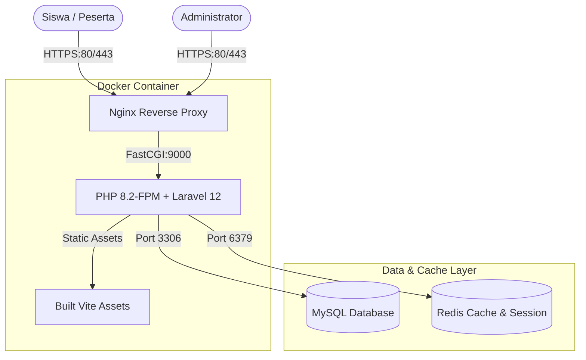

# 🏛️ Platform Edukasi & Seleksi Online Empat Pilar MPR RI

[](https://laravel.com)
[](https://php.net)
[](https://vitejs.dev)
[](https://www.docker.com)
[](https://github.com/features/actions)

Platform pembelajaran interaktif dan ujian seleksi nasional **Empat Pilar MPR RI** (Pancasila, UUD 1945, NKRI, dan Bhinneka Tunggal Ika) berbasis Computer Assisted Test (CAT) untuk siswa SMA/SMK se-Indonesia.

---

## 📌 Daftar Isi
- [Fitur Utama](#-fitur-utama)
- [Tech Stack](#-tech-stack)
- [Arsitektur & Keamanan Sistem](#-arsitektur--keamanan-sistem)
- [Struktur Direktori](#-struktur-direktori)
- [Panduan Instalasi Lokal (Tanpa Docker)](#-panduan-instalasi-lokal-tanpa-docker)
- [Panduan Instalasi Menggunakan Docker](#-panduan-instalasi-menggunakan-docker)
- [Alur CI/CD (GitHub Actions ke Docker Hub)](#-alur-cicd-github-actions-ke-docker-hub)
- [Akun Bawaan (Default Seeder)](#-akun-bawaan-default-seeder)
- [Lisensi](#-lisensi)

---

## 🚀 Fitur Utama

### 1. Modul Siswa (Peserta Seleksi)
- **Autentikasi & Keamanan:**
  - Registrasi akun dengan verifikasi **OTP Email**.
  - Dropdown wilayah berjenjang (*38 Provinsi* & *Kabupaten/Kota* se-Indonesia).
  - Lupa kata sandi 2 langkah via OTP aman.
- **Materi Pembelajaran & Video Edukasi:**
  - Artikel teks terstruktur seputar 4 Pilar Kebangsaan.
  - Video interaktif panduan dan pendalaman materi.
  - Tracking status penyelesaian modul (*Mark as Completed*).
- **Sistem Ujian CAT / CBT:**
  - **Latihan Mandiri:** Latihan soal tanpa batas untuk mengasah pemahaman.
  - **Ujian Seleksi Real:** Ujian resmi dengan batas waktu ketat (*countdown timer*), navigasi nomor soal instan, dan hanya dapat dikerjakan satu kali.
  - **Pengacakan Soal Regional:** Algoritma pengacakan soal (*Deterministic Seed Shuffling*) berbasis wilayah provinsi dan identitas peserta untuk mencegah kecurangan.
  - **Hasil Instan:** Pembahasan soal dan kalkulasi skor otomatis setelah submit.
- **Papan Peringkat (Leaderboard) Berjenjang:**
  - Peringkat Nasional.
  - Filter peringkat per Provinsi dan per Kabupaten/Kota.
  - Penentuan ranking: Skor Tertinggi $\rightarrow$ Waktu Pengerjaan Tercepat $\rightarrow$ Waktu Submit Terdahulu.
- **Pengawasan & Sesi Zoom Virtual:**
  - Akses jadwal pembekalan / pengawasan virtual terintegrasi dengan pencatatan kehadiran (*attendance tracking*).

### 2. Modul Admin Panel
- **Dashboard Analitik:** Ringkasan statistik siswa, materi, bank soal, dan keaktifan peserta.
- **Manajemen Konten:** CRUD Materi Bacaan, Video Tutorial, dan Kategori Pilar.
- **Manajemen Bank Soal & Kuis:**
  - CRUD Kuis Latihan & Ujian Real.
  - Pembuatan soal pilihan ganda (A, B, C, D, E).
  - Import bank soal massal via template.
  - Pengaturan status aktifasi ujian secara global maupun individual.
- **Monitoring Peserta & Pelaporan:**
  - Pemantauan hasil seleksi siswa secara langsung.
  - Export data peserta dan nilai ke format spreadsheet (Excel/CSV).
- **Manajemen Sesi Virtual (Zoom Sessions):**
  - Buat jadwal sesi Zoom, kelola peserta terdaftar, dan export riwayat presensi.

---

## 🛠️ Tech Stack

| Komponen | Teknologi |
| :--- | :--- |
| **Framework Backend** | [Laravel 12](https://laravel.com) (PHP 8.2+) |
| **Frontend Assets** | [Vite](https://vitejs.dev), Blade Templating, Vanilla JS & Modern CSS |
| **Database** | MySQL 8.0 / MariaDB |
| **Cache & Queue** | Redis (Predis Client) / Database Driver |
| **High Performance** | Laravel Octane ready |
| **Containerization** | Docker (Alpine Linux, PHP-FPM, Nginx) |
| **Orchestration** | Docker Compose |
| **CI/CD Automation** | GitHub Actions & Docker Hub Registry |

---

## 🔒 Arsitektur & Keamanan Sistem



- **Anti-Curang Regional:** Pengacakan nomor soal dan opsi jawaban menggunakan kombinasi hash `user_id` + `province_id`.
- **Proteksi Brute Force:** Rate limiter bawaan pada autentikasi login (`throttle:auth`) dan pengiriman kode OTP (`throttle:otp`).
- **Enkripsi Data:** Sandi dienkripsi dengan algoritma standar Bcrypt.

---

## 📂 Struktur Direktori

```plaintext
edu-siswa-empat-pilar/
├── .github/
│   └── workflows/
│       └── docker-ci.yml       # Workflow CI/CD otomatis ke Docker Hub
├── app/
│   ├── Http/Controllers/       # Auth, Admin, dan Siswa Controllers
│   ├── Models/                 # User, Question, Quiz, Attempt, Province, dll.
│   └── Services/               # Logika Shuffling Soal & Bisnis
├── config/                     # Konfigurasi aplikasi & Octane
├── database/
│   ├── migrations/             # Skema tabel database
│   └── seeders/                # Data awal (wilayah 38 provinsi, pilar, admin)
├── docker/
│   ├── entrypoint.sh           # Script startup container
│   └── nginx/
│       └── default.conf        # Konfigurasi web server Nginx
├── public/                     # Dokumen web publik & build asset
├── resources/                  # Blade Views & resource CSS/JS
├── routes/                     # web.php & console.php
├── Dockerfile                  # Multi-stage production container build
├── docker-compose.yml          # Konfigurasi environment Docker lokal
└── README.md                   # Dokumentasi resmi proyek
```

---

## 💻 Panduan Instalasi Lokal (Tanpa Docker)

Jika Anda ingin menjalankan aplikasi langsung menggunakan PHP & MySQL lokal (seperti XAMPP):

1. **Clone Repositori:**
   ```bash
   git clone https://github.com/username/edu-siswa-empat-pilar.git
   cd edu-siswa-empat-pilar
   ```

2. **Install Dependensi:**
   ```bash
   composer install
   npm install
   ```

3. **Konfigurasi Environment:**
   Salin file `.env.example` ke `.env`:
   ```bash
   cp .env.example .env
   php artisan key:generate
   ```
   Sesuaikan konfigurasi database di file `.env`:
   ```env
   DB_CONNECTION=mysql
   DB_HOST=127.0.0.1
   DB_PORT=3306
   DB_DATABASE=empat_pilar
   DB_USERNAME=root
   DB_PASSWORD=
   ```

4. **Jalankan Migrasi & Seeder:**
   ```bash
   php artisan migrate --seed
   ```

5. **Kompilasi Frontend & Jalankan Server:**
   ```bash
   npm run build
   php artisan serve
   ```
   Aplikasi siap diakses di `http://127.0.0.1:8000`.

---

## 🐳 Panduan Instalasi Menggunakan Docker

Dengan Docker, Anda tidak perlu menginstall PHP, Composer, ataupun MySQL secara manual di sistem operasi host.

### Prasyarat
- Pastikan [Docker Desktop](https://www.docker.com/products/docker-desktop/) sudah terinstall dan berjalan di komputer Anda.

### Langkah Menjalankan:
1. **Build dan Jalankan Container:**
   ```bash
   docker compose up -d --build
   ```
   *Layanan yang berjalan:*
   - **Aplikasi (Nginx + PHP 8.2-FPM):** Port `http://localhost:8080`
   - **MySQL 8.0:** Port `3307` (tidak akan bentrok dengan MySQL bawaan XAMPP)
   - **Redis:** Port `6380`

2. **Jalankan Migrasi & Database Seeder di dalam Container:**
   ```bash
   docker compose exec app php artisan key:generate
   docker compose exec app php artisan migrate --seed
   ```

3. **Perintah Berguna Docker:**
   ```bash
   # Melihat status container
   docker compose ps

   # Melihat log aplikasi secara live
   docker compose logs -f app

   # Masuk ke terminal container aplikasi
   docker compose exec app sh

   # Mematikan container
   docker compose down
   ```

---

## 🔄 Alur CI/CD (GitHub Actions ke Docker Hub)

Project ini telah dilengkapi pipeline otomatisasi pada file [`.github/workflows/docker-ci.yml`](.github/workflows/docker-ci.yml).

### Alur Kerja:
1. Setiap kali kode di-push ke branch `main` atau `syaiful`:
   - GitHub Actions akan memicu mesin virtual Ubuntu.
   - Stage 1: Melakukan build asset frontend via Vite (`npm run build`).
   - Stage 2: Meracik image PHP 8.2 + Nginx production.
   - Stage 3: Mengunggah (*push*) image secara otomatis ke **Docker Hub**.
2. **Kredensial GitHub Secrets yang Dibutuhkan:**
   - `DOCKERHUB_USERNAME`: Username akun Docker Hub Anda.
   - `DOCKERHUB_TOKEN`: Personal Access Token (PAT) dari Docker Hub.

---

## 🔑 Akun Bawaan (Default Seeder)

Setelah menjalankan `php artisan db:seed`, akun berikut siap digunakan:

| Role | Email | Password | URL Login |
| :--- | :--- | :--- | :--- |
| **Administrator** | `admin@gmail.com` | `password` | `/admin/login` |
| **Siswa (Peserta)** | Registrasi mandiri via `/register` (menggunakan verifikasi OTP) | - | `/login` |

---

## 📄 Lisensi
Hak Cipta &copy; 2026 Tim Pengembang Platform Empat Pilar. Dilindungi Undang-Undang.
